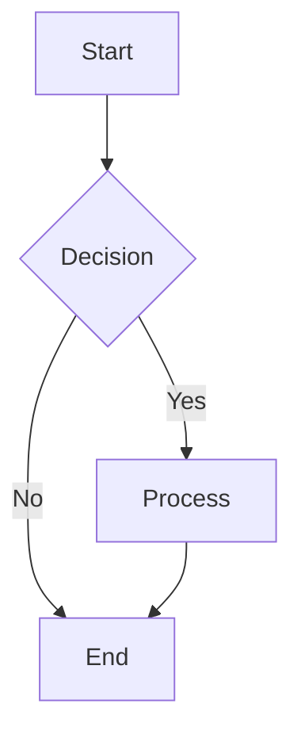

# H1 Header
## H2 Header
### H3 Header
#### H4 Header
##### H5 Header
###### H6 Header
```

**Alternative syntax for H1 and H2:**
```markdown
H1 Header
=========

H2 Header
---------
```

## Text Formatting

### Basic Formatting

```markdown
**Bold text** or __Bold text__
*Italic text* or _Italic text_
***Bold and italic*** or ___Bold and italic___
~~Strikethrough text~~
`Inline code`
```

**Result:**
- **Bold text**
- *Italic text*
- ***Bold and italic***
- ~~Strikethrough text~~
- `Inline code`

### Subscript and Superscript

```markdown
H<sub>2</sub>O
X<sup>2</sup>
```

**Result:**
- H<sub>2</sub>O
- X<sup>2</sup>

## Lists

### Unordered Lists

```markdown
- Item 1
- Item 2
  - Nested item 2.1
  - Nested item 2.2
    - Double nested item
- Item 3

* Alternative syntax
+ Another alternative
```

### Ordered Lists

```markdown
1. First item
2. Second item
   1. Nested numbered item
   2. Another nested item
3. Third item

1. You can use 1. for all items
1. GitHub will auto-number them
1. This makes reordering easier
```

### Task Lists

```markdown
- [x] Completed task
- [ ] Incomplete task
- [x] Another completed task
  - [x] Nested completed task
  - [ ] Nested incomplete task
```

**Result:**
- [x] Completed task
- [ ] Incomplete task
- [x] Another completed task

## Links

### Basic Links

```markdown
[Link text](https://example.com)
[Link with title](https://example.com "This is a title")
<https://example.com>
<email@example.com>
```

### Reference Links

```markdown
[Link text][reference]
[Another link][1]

[reference]: https://example.com
[1]: https://example.com "Optional title"
```

### Internal Links

```markdown
[Link to header](#headers)
[Link to section](#text-formatting)
```

## Images

### Basic Images

```markdown


```

### Images with Links

```markdown
[](https://example.com)
```

### Reference Images

```markdown
![Alt text][image-reference]

[image-reference]: https://via.placeholder.com/150
```

## Code

### Inline Code

```markdown
Use `git status` to check repository status.
```

### Code Blocks

#### Fenced Code Blocks

```markdown
```javascript
function hello() {
    console.log("Hello, World!");
}
```
```

#### Indented Code Blocks

```markdown
    function hello() {
        console.log("Hello, World!");
    }
```

### Syntax Highlighting

```markdown
```python
def hello_world():
    print("Hello, World!")
    return True
```

```bash
git clone https://github.com/user/repo.git
cd repo
npm install
```

```json
{
  "name": "example",
  "version": "1.0.0",
  "dependencies": {
    "express": "^4.17.1"
  }
}
```
```

## Tables

### Basic Table

```markdown
| Header 1 | Header 2 | Header 3 |
|----------|----------|----------|
| Row 1    | Data     | More data|
| Row 2    | Data     | More data|
```

### Table Alignment

```markdown
| Left Aligned | Center Aligned | Right Aligned |
|:-------------|:--------------:|--------------:|
| Left         | Center         | Right         |
| Text         | Text           | Text          |
```

**Result:**

| Left Aligned | Center Aligned | Right Aligned |
|:-------------|:--------------:|--------------:|
| Left         | Center         | Right         |
| Text         | Text           | Text          |

## Blockquotes

```markdown
> This is a blockquote
> 
> It can span multiple lines

> Nested blockquotes
>> Are also possible
>>> And can go deeper
```

**Result:**
> This is a blockquote
> 
> It can span multiple lines

## Horizontal Rules

```markdown
---
***
___
```

**Result:**

---

## GitHub-Specific Features

### Mentions

```markdown
@username - Mention a user
@org/team - Mention a team
```

### Issue and PR References

```markdown
#123 - Reference issue/PR by number
user/repo#123 - Reference issue/PR in another repo
SHA: a5c3785ed8d6a35868bc169f07e40e889087fd2e
```

### Emoji

```markdown
:smile: :heart: :thumbsup: :rocket: :octocat:
```

**Result:** 😄 ❤️ 👍 🚀 🐙

### Keyboard Keys

```markdown
Press <kbd>Ctrl</kbd> + <kbd>C</kbd> to copy
```

**Result:** Press <kbd>Ctrl</kbd> + <kbd>C</kbd> to copy

### Collapsible Sections

```markdown
<details>
<summary>Click to expand</summary>

This content is hidden by default.

- You can put any markdown here
- Including code blocks
- And other formatting

</details>
```

**Result:**
<details>
<summary>Click to expand</summary>

This content is hidden by default.

- You can put any markdown here
- Including code blocks
- And other formatting

</details>

### Alerts (GitHub's New Feature)

```markdown
> [!NOTE]
> This is a note alert

> [!TIP]
> This is a tip alert

> [!IMPORTANT]
> This is an important alert

> [!WARNING]
> This is a warning alert

> [!CAUTION]
> This is a caution alert
```

### Math Expressions

```markdown
Inline math: $x = y + z$

Block math:
$$
\sum_{i=1}^{n} x_i = x_1 + x_2 + \ldots + x_n
$$
```

### Diagrams with Mermaid

```markdown

```

### Footnotes

```markdown
Here's a sentence with a footnote[^1].

[^1]: This is the footnote content.
```

## Advanced Features

### HTML in Markdown

```markdown
<div align="center">
  
</div>

<details>
<summary><strong>Custom styling</strong></summary>
<br>
You can use HTML for more control over formatting.
</details>
```

### Escape Characters

```markdown
\*This text is not italic\*
\# This is not a header
\`This is not code\`
```

### Line Breaks

```markdown
Line 1  
Line 2 (two spaces at end of Line 1)

Line 1

Line 2 (blank line between)
```

## Best Practices

### README Structure

```markdown
# Project Title

Brief description of what the project does.

## Features

- Feature 1
- Feature 2
- Feature 3

## Installation

```bash
npm install project-name
```

## Usage

```javascript
const project = require('project-name');
project.doSomething();
```

## Contributing

1. Fork the repository
2. Create a feature branch
3. Make your changes
4. Submit a pull request

## License

This project is licensed under the MIT License - see the [LICENSE](LICENSE) file for details.
```

### Documentation Tips

1. **Use clear, descriptive headers**
2. **Include a table of contents for long documents**
3. **Add code examples with syntax highlighting**
4. **Use task lists for project status**
5. **Include badges for build status, version, etc.**
6. **Keep lines under 80 characters when possible**
7. **Use relative links for internal documentation**

### Common Badges

```markdown


```

### Useful Links

- [GitHub Flavored Markdown Spec](https://github.github.com/gfm/)
- [Markdown Guide](https://www.markdownguide.org/)
- [Emoji Cheat Sheet](https://github.com/ikatyang/emoji-cheat-sheet)
- [Shields.io](https://shields.io/) - For badges
- [Mermaid Documentation](https://mermaid.js.org/) - For diagrams

---

## Quick Reference Cheat Sheet

| Element | Syntax |
|---------|--------|
| Bold | `**text**` or `__text__` |
| Italic | `*text*` or `_text_` |
| Code | `code` |
| Link | `[title](url)` |
| Image | `` |
| Header | `# H1` to `###### H6` |
| List | `- item` or `1. item` |
| Task | `- [x] done` or `- [ ] todo` |
| Quote | `> quote` |
| Table | `| col1 | col2 |` |
| Code block | ` ```language ` |
| Strikethrough | `~~text~~` |
| Horizontal rule | `---` |

---
